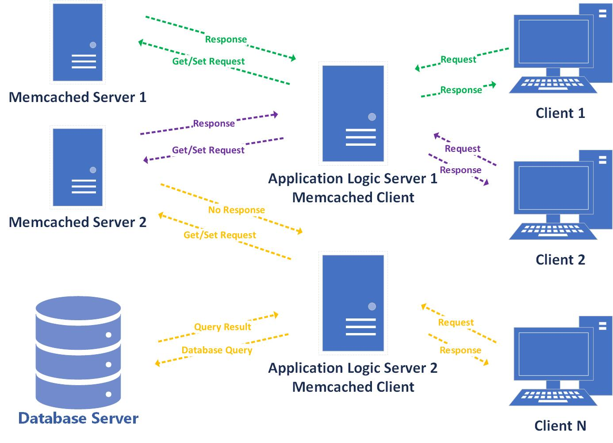
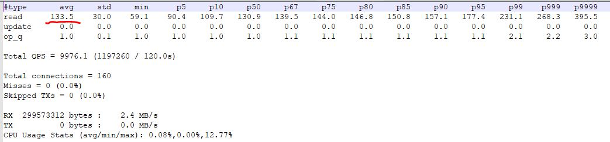
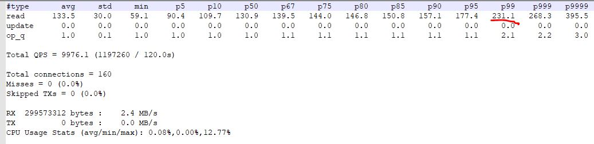
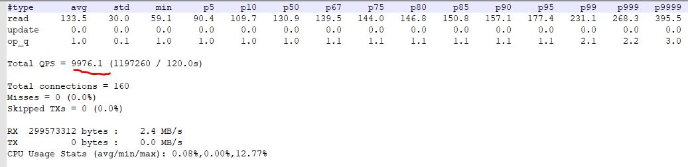
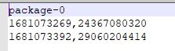
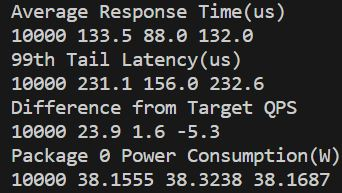

# Lab 1: Unix Commands and Bash Scripting
The goal of this lab tutorial is to give you hands-on experience with unix commands and bash scripts that you will find helpful for this course.

## Prerequisites

### Version Control: Git and GitHub
Git is a distributed version control system for managing source code. Version control is a system for tracking changes to files. As you modify files, the version control system records and saves each change. This allows you to restore a previous version of your code at any time.

GitHub is a code hosting platform for version control and collaboration. It lets you and others work together on projects from anywhere. Go there and create an account if you don’t have one.

A typical workflow involves editing and working on your content in your local repository on your computer, and then sending your changes to the remote repository on GitHub.


### Join GitHub
You can use [GitHub](https://github.com/), a [Git](https://git-scm.com/) repository hosting service, for storing, managing, tracking and controlling changes to your code.
In order to gain access to GitHub you need to register for an account. To do so:

- Go to https://github.com/ and hit **Sign Up**.
- On the page fill out all the usual fields asking you for username, password, etc.
- You should upload a SSH key, please see [Github's guide to generating a SSH key](https://docs.github.com/en/authentication/connecting-to-github-with-ssh/generating-a-new-ssh-key-and-adding-it-to-the-ssh-agent) should you need help with this.
- You might want to read through the [Git Guide](https://github.com/git-guides).


### Getting started
Open a remote SSH terminal session to node0. Make sure you enable forwarding of the authentication agent connection.

Make sure you have already installed Git on your working machine (node0). To check if git is already installed, open the Terminal and hit:
```
git --version
```
To install the latest version of git:
```
sudo apt -y install git
```
### Working locally
To use Git you will have to setup a repository. You can take an existing directory to make a Git repository, or create an empty directory.
```
# create a new directory, and initialize it with git-specific functions
git init my-repo

# change into the `my-repo` directory
cd my-repo

# create the first file in the project
touch README.md

# git isn't aware of the file, stage it
git add README.md

# take a snapshot of the staging area
git commit -m "add README to initial commit"
```
### Hosting your source code on GitHub
You need to create a repository for your project. Do not initialize the repository with a README, .gitignore or License file. This empty repository will await your code.

<figure>
  <p align="center"></p>
  <figcaption><p align="center">Figure. Creating a new GitHub repository.</p></figcaption>
</figure>


Before you can push commits made on your local branch to a remote repository, you will need to provide the path for the repository you created on GitHub and rename your local branch.

Providing the path to the remote repository
You can push commits made on your local branch to a remote repository identified by a remote URL. A remote URL is Git's fancy way of saying "the place where your code is stored". That URL could be your repository on GitHub, or another user's fork, or even on a completely different server.

You can only push to two types of URL addresses:

An HTTPS URL like `https://github.com/user/repo.git`. The `https://` URLs are available on all repositories, regardless of visibility. https:// URLs work even if you are behind a firewall or proxy.
An SSH URL, like git@github.com:user/repo.git. SSH URLs provide access to a Git repository via SSH, a secure protocol. To use these URLs, you must generate an SSH keypair on your computer and add the public key to your account on GitHub.com. For more information, see Connecting to GitHub with SSH.
You can use the git remote add command to match a remote URL with a name. For example, you'd type the following in the command line:
```
git remote add origin  <REMOTE_URL>
``` 
This associates the name origin with the `REMOTE_URL`.

You can use the command `git remote set-url` to change a remote's URL.

To provide the path for the repository you created on GitHub using the SSH URL:
```
git remote add origin git@github.com:YOUR-USERNAME/YOUR-REPOSITORY-NAME.git
```
### Renaming the default branch
Every Git repository has an initial branch, which is the first branch to be created when a new repository is generated. Historically, the default name for this initial branch was `master`, but `main` is an increasingly popular choice.

Since the default branch name for new repositories created on GitHub is now `main`, you will have to to rename your local `master` branch to `main`:
```
git branch -M main
```
### Pushing and fetching changes
You're now setup to push changes to the remote repository:
```
git push -u origin main
```
If you're already setup for push as above, then the following will bring changes down and merge them in:
```
git pull
```
What this is doing under-the-hood is running a `git fetch` and then `git merge`.

### Cloning an existing repository
If you want to get a copy of an existing Git repository, the command you need is `git clone`.

For example, to get a copy of the course's repository using an HTTPS URL:

git clone https://github.com/ucy-xilab/cs605-fa23.git

## Exercise: Unix Commands
In the Moodle page of CS605 under lab1 there are two datasets small_dataset and big_dataset. For this set of exercises you will need to download the small_dataset. The small_dataset contains measurements(average latency, tail latency, power measurements) of a Memcached workload for a specific query arrival rate (10K queries/second) for 5 runs. Aim of this exercise is to parse the measurements using unix commands and pipes only, no intermediate files.  

### Memcached
`Memcached` (https://memcached.org/) is a lightweight key-value store that is widely deployed as a distributed caching service to accelerate user-facing applications with stringent latency requirements by alleviating the database load. It’s characterized by high performance and scalability due to its lock-friendly implementation, offering deterministic response times in the scale of microseconds and its scale out approach (adding more servers) allowing support for high loads. At the same time, however, its simplicity prevents support of features like replication and synchronization in a multi-node-instance deployment and support of data structures in the key-value store. Lastly, the use of techniques like least recently used cache replacement policy and item expiration time allows it to achieve its caching objective.

Memcached consists of two components: the `Memcached client` and the `Memcached server`. The client is responsible for distributing the requests to the appropriate Memcached server based on the requested key through a client-based hashing (consistent hashing or Rendezvous) algorithm. The Memcached server consists of the server software, which is responsible for maintaining the in-memory hash table for indexing the key-value entries and the Least Recently Used (LRU) list for evicting old entries. 

<figure>
  <p align="center"></p>
  <figcaption><p align="center">Figure. High Level Architecture of Memcached.</p></figcaption>
</figure>


### Mutilate

`Mutilate` (https://github.com/leverich/mutilate) is a memcached load generator designed for high request rates, good tail-latency measurements, and realistic request stream generation. It contains hard-coded distributions that recreate the "ETC" request stream from facebook(Berk Atikoglu et al., Workload Analysis of a Large-Scale Key-Value Store, SIGMETRICS 2012). We use this facebook distributions to generate the measurements of small_dataset and big_dataset.

Mutilate reports the latency (average, minimum, and various percentiles) for get and set commands, as well as achieved QPS and network goodput.

<figure>
  <p align="center"></p>
  <figcaption><p align="center">Figure. Example of Mutilate Output.</p></figcaption>
</figure>

### Average Response Time
`Average Response Time` represents the average time required to serve a query(from the moment the client sends a request until it receives an answer). The average response time of each run is located in the mcpef file which contains the measurements reported by mutilate. 

<figure>
  <p align="center"></p>
  <figcaption><p align="center">Figure. Mutilate Average Response Time.</p></figcaption>
</figure>

In this exercise you are asked to print the average response time of each run on the same line separated by space. The results should be the following:
```
133.5 88.0 132.0 107.8 110.8
```
`Helpful commands: cat, grep, awk, tr`

### 99th Tail Latency
`99th Tail Latency` represents the maximum latency for the fastest 99% of requests. The are different latency percentiles 50%, 90%, 95%, 99.9% etc but the most common one is the 99th percentile. It is an importantn metric to consider when evaluating the performance of large-scale interactive services such as websearch. This is because average only accounts for 50% of the client base quality of service which is a small percentage. 

<figure>
  <p align="center"></p>
  <figcaption><p align="center">Figure. Mutilate 99th Tail Latency.</p></figcaption>
</figure>

In this exercise you are asked to print the 99th tail latency of each run on the same line separated by space. The results should be the following:
```
231.1 156.0 232.6 227.8 226.1
```
`Helpful commands: cat, grep, awk, tr`

### Achieved QPS(queries per second)

Target QPS (queries per second) represents the requested rate at which the client sends queries to the server. Due to the fact that the client follows a distribution (outliers) the actual rate differs from the target QPS.

<figure>
  <p align="center"></p>
  <figcaption><p align="center">Figure. Mutilate Achieved QPS.</p></figcaption>
</figure>

In this exercise you are asked to print by how much the actual QPS differs from the actual QPS(10K) for each run on the same line separated by space. The results should be the following:
```
23.9 1.6 -5.3 7.5 -5.4
```
`Helpful commands: cat, grep, awk, tr`

### Rapl Power Measurements
`Intel's Running Average Power Limit (RAPL)` is a hardware feauture that among other things, it allows the monitoring of energy consumption across different domains of the CPU chip. This feauture was introduced in Intel's Sandy Bridge architecture and has evolved in the later versions of Intel's architecture. RAPL is based on a combination of models and real measurements for this reason the reported power conusmption has some error.

In the provided dataset (small_dataset), there are also power measurements using RAPL counters for package-0, package-1 (dual-socket system) and dram-0, dram-1 under the memcached directory of each run. The format of the file is the following: timestamp, measurement in milliJoules. The difference between the second measurment and the first one is the energy the system consumed during the period between the first measurment and the second one. 

<figure>
  <p align="center"></p>
  <figcaption><p align="center">Figure. RAPL measurements for Pkg-0.</p></figcaption>
</figure>

To convert the RAPL measurements into power consumption you have to perform the following transformation: (m2-m1/t2-t1) /1,000,000.

In this exercise you are asked to print the power consumption of package-0 for each run on the same line separated by space. The results should be the following:
```
38.1555 38.3238 38.1687 38.1722 38.3208 
```
`Helpful commands: awk, tr`

## Exercise: Bash Scripting

For this set of exercises you will need to download the big_dataset from the Moodle page of CS605. The big_dataset contains measurements(average latency, tail latency, power measurements) of a Memcached workload for several query arrival rates (10K,50K,100K,200K,300K,400K,500K queries/second) for 5 runs. Aim of this exercise is to use the solutions of the previous exercise (Exercise: Unix Commands) to create a script.


### How to Test
Under the src/ directory of lab1, there is a sceleton script that you will have to complete, in order to create a data parser script. In order to be able to test the script you have to do the following:

* To run the script, you must first change its permissions to execute.
```
chmod 777 ./parser.sh
```
* You have to pass two arguments when running the script. The first argument is the function you want to execute(in our case ./parser.sh parse_data). The second argument is the path to the big_dataset (i.e. ./parser.sh parse_data /home/ganton12/big_dataset).


### What to implement
The functions you will need to complete are the following:

`check_arguments`: Check whether argument exists, is a directory, and is not an empty directory         
`average_time`, `99th_time`, `target_qps`, `power_pkg0`: The output of all these functions should follow the format 1st line: [Metric] rest: [QPS] [Measurements] 

<figure>
  <p align="center"></p>
  <figcaption><p align="center">Figure. Example Output.</p></figcaption>
</figure>


