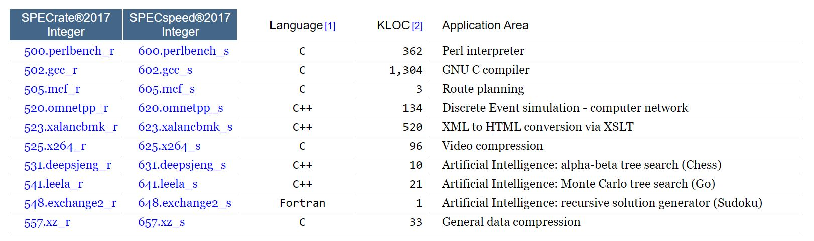
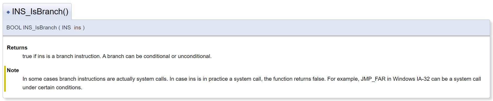
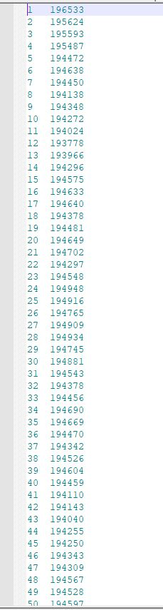
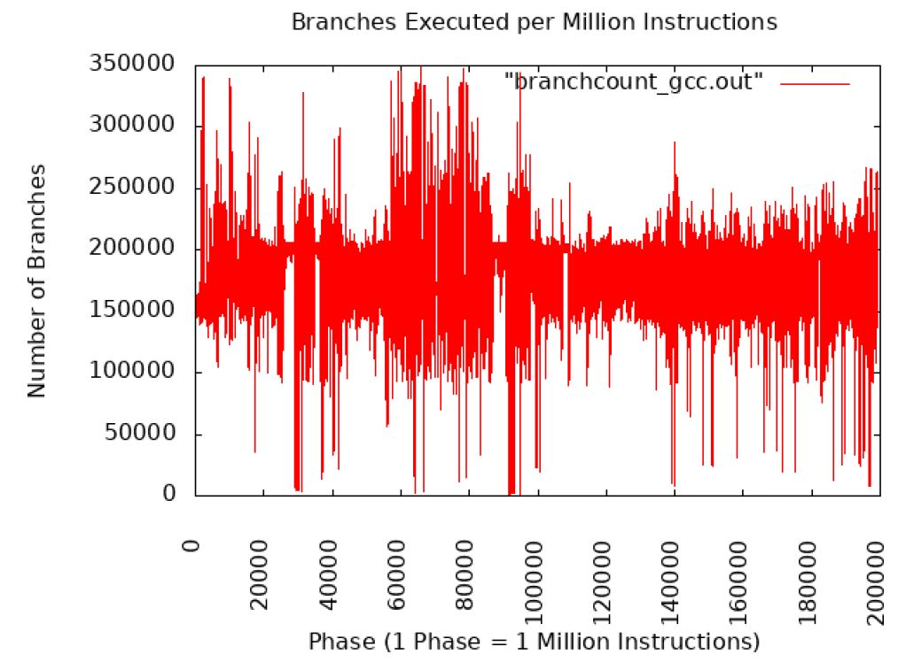
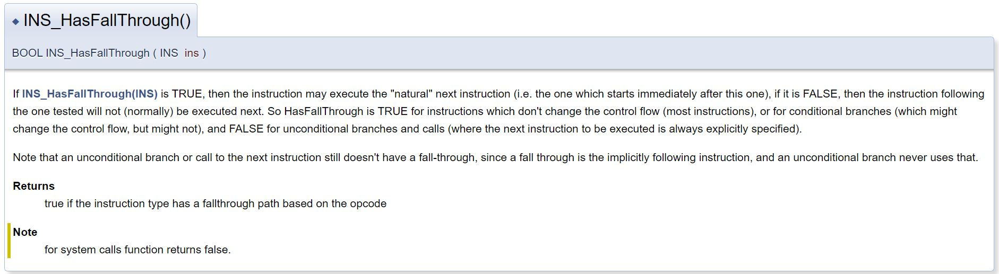
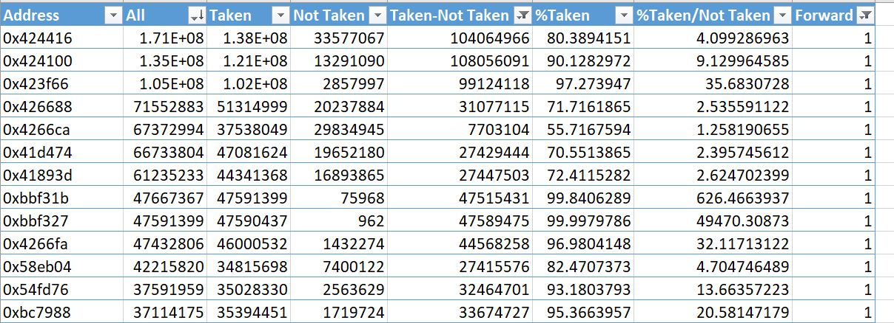

# Lab 2: Intel Pin Tool
The goal of this lab tutorial is to give you hands-on experience with intel pin tool that you will find helpful for this course.

## Intel Pin Tool

Pin is a tool for the instrumentation of programs. It supports the Linux*, macOS* and Windows* operating systems and executables for the IA-32, Intel(R) 64 and Intel(R) Many Integrated Core architectures.

Pin allows a tool to insert arbitrary code (written in C or C++) in arbitrary places in the executable. The code is added dynamically while the executable is running. This also makes it possible to attach Pin to an already running process.

Pin provides a rich API that abstracts away the underlying instruction set idiosyncracies and allows context information such as register contents to be passed to the injected code as parameters. Pin automatically saves and restores the registers that are overwritten by the injected code so the application continues to work. Limited access to symbol and debug information is available as well.

Pin includes the source code for a large number of example instrumentation tools like basic block profilers, cache simulators, instruction trace generators, etc. It is easy to derive new tools using the examples as a template.


### Overview

Pin is like a "just in time" (JIT) compiler. The input to this compiler is a regular executable. Pin intercepts the execution of the first instruction of the executable and generates ("compiles") new code for the straight line code sequence starting at this instruction. It then transfers control to the generated sequence. The generated code sequence is almost identical to the original one, but Pin ensures that it regains control when a branch exits the sequence. After regaining control, Pin generates more code for the branch target and continues execution. Pin makes this efficient by keeping all of the generated code in memory so it can be reused and directly branching from one sequence to another.The only code ever executed is the generated code. The original code is only used for reference. When generating code, Pin gives the user an opportunity to inject their own code (instrumentation).

### Pintools

Instrumentation consists of two components:

* A mechanism that decides where and what code is inserted
* The code to execute at insertion points

These two components are instrumentation and analysis code. Both components live in a single executable, a Pintool. Pintools can be thought of plugins that can modify the code generation process inside Pin.

The Pintool registers callback routines with Pin that are called from Pin whenever new code needs to be generated. This routine represents the instrumentation component. It inspects the code to be generated, investigates its static properties, and decides if and where to inject calls to analysis code. Those calls can target arbitrary functions inside the Pintool. Pin makes sure that register state is saved and restored as necessary and allow arguments to be passed to the functions.

### Instrumentation Granularity

* Trace instrumentation: lets the Pintool inspect and instrument an executable one dynamic trace of instructions at a time. Pin breaks a trace into basic blocks, BBLs. A BBL is a single entrance, single exit sequence of instructions. It is often possible to insert a single analysis call for a BBL, instead of one analysis call for every instruction (which incurs more runtime overhead). Trace instrumentation utilizes the TRACE_AddInstrumentFunction API call. Think of Trace Instrumentation as BBL instrumentation. 

* Instruction instrumentation: lets the tool inspect and instrument an executable a single instruction at a time. This is essentially identical to trace instrumentation where the Pintool writer has been freed from the responsibilty of iterating over the instructions inside a trace. Instruction instrumentation utilizes the INS_AddInstrumentFunction API call.

* Image instrumentation lets the Pintool inspect and instrument an entire image, IMG: Image Object, when it is first loaded. A Pintool can walk the sections, SEC: Section Object, of the image, the routines, RTN: Routine Object, of a section, and the instructions. Image instrumentation utilizes the IMG_AddInstrumentFunction API call. Image instrumentation depends on symbol information to determine routine boundaries hence PIN_InitSymbols must be called before PIN_Init.

* Routine instrumentation lets the Pintool inspect and instrument an entire routine when the image it is contained in is first loaded. A Pintool can walk the instructions of a routine. There is not enough information available to break the instructions into BBLs. Instrumentation can be inserted so that it is executed before or after a routine is executed, or before or after an instruction is executed. Routine instrumentation utilizes the RTN_AddInstrumentFunction API call.


### Intel Pin Tool Syntax
```
pin [pin-option]... -t [toolname] [tool-options]... -- [application] [application-option]
```

* pin: Instrumentation Engine (provided in the kit)
* toolname: Instrumentation tool (write your own or provided in the kit)
* -pause_tool n: is a useful Pin-option which prints out the process id and pauses Pin for n seconds to permit attaching with gdb.
* -pid pid: attach Pin and the Pintool to an already running executable with the given process id.

The tool-options follow immediately after the tool specification and depend on the tool used. Everything following the -- is the command line for the application.

### Installing Pin 

You can find the pintool executable at the Moodle page of CS605 under Lab2. Download the tar file at your working directory(). 

```
tar xvf pin-3.13-98189-g60a6ef199-gcc-linux.tar.gz
mv pin-3.13-98189-g60a6ef199-gcc-linux pin-3.13
cd pin-3.13/source/tools/ManualExamples
make # do not do this it compiles all tools
make inscount0.test # compiles only inscount0 and puts the executable under the directory /obj-intel64
../../../pin -t obj-intel64/inscount0.so -- /bin/ls # prints the number of instructions in ls
```
## SPEC Benchmarks

The `Standard Performance Evaluation Corporation (SPEC)` is a non-profit corporation formed to establish, maintain and endorse standardized benchmarks and tools to evaluate performance and energy efficiency for the newest generation of computing systems. SPEC develops benchmark suites and also reviews and publishes submitted results from our member organizations and other benchmark licensees.

### SPEC's Benchmarks and Tools

Some of the current benchmarks are the following:
* `SPEC Cloud IaaS 2018:` is SPEC's second benchmark suite to measure cloud performance. The benchmark suite's use is targeted at cloud providers, cloud consumers, hardware vendors, virtualization software vendors, application software vendors, and academic researchers. The SPEC Cloud® IaaS 2018 benchmark addresses the performance of infrastructure-as-a-service (IaaS) cloud platforms. The benchmark stresses provisioning as well as runtime aspects of a cloud using I/O and CPU intensive cloud computing workloads. SPEC selected the social media NoSQL database transaction and K-Means clustering using map/reduce as two significant and representative workload types within cloud computing. The first workload uses the Yahoo Cloud Serving benchmark with the NoSQL Cassandra database. The second workload uses KMeans from Intel Hibench Suite for Hadoop.

* `SPEC CPU 2017:` SPEC designed these suites to provide a comparative measure of compute-intensive performance across the widest practical range of hardware using workloads developed from real user applications. The SPEC CPU® 2017 benchmark package contains SPEC's next-generation, industry-standardized, CPU intensive suites for measuring and comparing compute intensive performance, stressing a system's processor, memory subsystem and compiler. The SPEC CPU 2017 benchmark package contains 43 benchmarks, organized into four suites:

    * The SPECspeed® 2017 Integer and SPECspeed® 2017 Floating Point suites are used for comparing time for a computer to complete single tasks.
    * The SPECrate® 2017 Integer and SPECrate® 2017 Floating Point suites measure the throughput or work per unit of time.

<figure>
  <p align="center"></p>
  <figcaption><p align="center">Figure. Example of SPEC CPU Benchmarks 2017.</p></figcaption>
</figure>

* `SPECviewperf 2020:` is the worldwide standard for measuring graphics performance based on professional applications. The benchmark measures the 3D graphics performance of systems running under the OpenGL and DirectX application programming interfaces. The benchmark workloads are called viewsets, and represent graphics content and behavior from actual workstation-class applications, without the need to install the applications themselves.

* `SPEC ACCEL:` The SPEC ACCEL® benchmark suite tests performance with computationally intensive parallel applications running under the OpenCL, OpenACC, and OpenMP 4 target offloading APIs. The suite exercises the performance of the accelerator, host CPU, memory transfer between host and accelerator, support libraries and drivers, and compilers.


`We will focus only on SPEC CPU 2017.` Below are some of the commands we will use to run some of the benchmarks and test our pintools. You can find the executables and the input data in this directory:
/home/students/cs/benchmarks/CPU2017/CPU2017Source/benchspec/CPU/

* `GCC:` cpugcc_r_base.EPL221SingleCore-gcc4.8.5-linux3.10-bits-64 gcc-pp.c -O3 - finline-limit=0 -fif-conversion -fif-conversion2 -o gcc-pp.opts-O3_-finlinelimit_0_-fif-conversion_-fif-conversion2.s > gcc-pp.opts-O3_-finline-limit_0_- fif-conversion_-fif-conversion2.out

* `Bwaves:` bwaves_r_base.EPL221SingleCore-gcc4.8.5-linux3.10-bits-64 bwaves_1 < bwaves_1.in > bwaves_1.out

## Exercise: Pin Tools

For this set of exercises you will need to install Intel Pin Tool (see section Installing pin) and run two SPEC2017 benchmarks GCC and Bwaves (see section SPEC Benchmarks).

### Measure Number of Branch Instructions
`Branch Instructions` are a type of machine-level instructions used to alter the sequence of program execution. They are fundamental in controlling the flow of a program and implementing conditional and unconditional jumps.

Here are the two main types of branch instructions:

* `Conditional Branch Instructions:` These instructions are used to make decisions in a program based on certain conditions. They typically involve a comparison or evaluation of some condition, and the program can branch (jump) to a different location in memory depending on whether the condition is true or false. For example, "branch if equal" (BEQ) might jump to a specified address if two values are equal.

* `Unconditional Branch Instructions:` These instructions are used to perform an unconditional jump or branch to a different location in the program. Unlike conditional branches, they do not depend on any condition or comparison. An example is the "jump" (JMP) instruction, which simply transfers control to a specific address without any condition.

In this exercise you are asked to modify the source code of inscount0.cpp in order to measure only the number of branch instructions for gcc and bwaves. The Pin Tool API contains the following function that you will need to use: 


<figure>
  <p align="center"></p>
  <figcaption><p align="center">Figure. API Call for INS_IsBranch.</p></figcaption>
</figure>

### Measure Number of Branch Instructions per 1M Instructions

Modify the code above so it only prints the number of branch instructions every 1M instructions. The isntrumentation routine should stay the same but the analysis routine must change. Please find below an example of the output. 

<figure>
  <p align="center"></p>
  <figcaption><p align="center">Figure. Number of Branches Per 1M Instructions Example.</p></figcaption>
</figure>


Once you calculate the number of branches per 1M instructions for gcc and bwaves, plot your results using the following command:

```
gnuplot 
plot "dataplot.txt" using 1:2 title 'GCC/Bwaves' with lines
```
<figure>
  <p align="center"></p>
  <figcaption><p align="center">Figure. Number of Branches Per 1M Instructions for GCC.</p></figcaption>
</figure>


### Measure Per Conditional Branch Number of Taken/Not-Taken
Measure for each conditional branch instruction how many times is executed. Additionally measure how many of these times the instruction was taken or not taken. Finally measure whether the target of the branch instructions was forward. In order to do that you will need the following:

* INS_HasFallThrough
<figure>
  <p align="center"></p>
  <figcaption><p align="center">Figure. API Call for INS_HasFallThrough.</p></figcaption>
</figure>

* `IARG_INST_PTR:` Type: ADDRINT. The address of the instrumented instruction. This value does not change at IPOINT_AFTER. This is simply shorthand for IARG_ADDRINT, INS_Address(ins).
* `IARG_BRANCH_TARGET_ADDR:` Type: ADDRINT. Target address of branch instruction.
* `IARG_BRANCH_TAKEN:` Type: BOOL. Non zero if a branch is taken.
* `std::map:` is a sorted associative container that contains key-value pairs with unique keys.


<figure>
  <p align="center"></p>
  <figcaption><p align="center">Figure. Example Output for Last Exercise.</p></figcaption>
</figure>

