# Lab 3: Useful Tools
The goal of this lab tutorial is to familiarize with linux tools that allow: monitoring utilities, producing graphs, performing correlation analysis.

## Top

The top (table of processes) command shows a real-time view of running processes in Linux and displays kernel-managed tasks. The command also provides a system information summary that shows resource utilization, including CPU and memory usage.

To run the top command, type top in the command line and press Enter. The command starts in interactive command mode, showing the active processes and other system information. To quit top, press q.

<figure>
  <p align="center">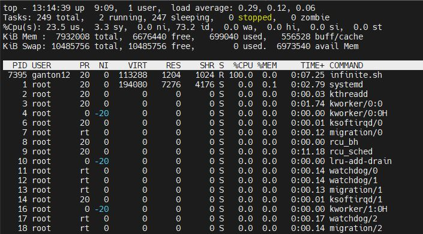</p>
</figure>

### Top Output

* `CPU utilization explanation:` 
    * us (user time) 
    * sy (system time) 
    * ni (processes that run at higher priority)
    * id (idle time) 
    * wa (cpu waiting for I/O), 
    * hi si (hardware and software interrupts)

* `Tasks:`
    * Total: Total processes in active mode
    * Running: Current running processes
    * Sleeping: indicates processes awaiting resources, which is a normal state.
    * Stopped: Total processes stopped (exiting and releasing resources)
    * Zombie: Total processes in zombie state (Zombie process or defunct process is a process that has completed execution but still has an entry in the process table. This entry is still needed to allow the parent process to read its child’s exit status.)

* `KiB Mem:`
    * total: Total system Memory
    * free: Free Memory
    * used: Current used memory by system
    * buf/cache: memory used by kernel biffers (/proc/meminfo), and page cache and slabs

* `KiB Swap:` Linux can take advantage of virtual memory when physical memory space is consumed by borrowing storage space from storage disks. The process of swapping data back and forth between physical RAM and storage drives is time-consuming and uses system resources, so it's best to minimize the use of virtual memory.
    * total: total swap memory in system
    * free: available swap space
    * used: current used swap memory by system

* `Running Processes Output:`
    * PID: pid of running process
    * USER: user under which process is running
    * PR: priority of running process
    * NI: nice value
    * VIRT: virtual memory used
    * RES: physical memory used
    * SHR: shared memory used
    * S: status of running process
    * %CPU: cpu used 
    * %MEM: RAM used by this process
    * TIME: time process is running for
    * COMMAND: name of process
 
### Top Useful Command Switches:

* top -d 1: set the update interval to 1 second (the default is 3 seconds)
* top b: run in batch mode, top will run until killed, useful for saving top output in a file
* top H: instruct top to show individual threads
* top u username: show processes of a specific user only 

### Top Useful Keys Interactive Mode:

* Press 1: Shows per core utilization
* Press Shift+p: Sort processes from lower to higher CPU utilization
* Press d: change the update delay
* Press u: to view a specific user

## Htop

htop (https://linux.die.net/man/1/htop) an interactive system monitor process viewer. Htop is the newer and improved version of top. Unlike top which comes preinstalled in all Linux distributions, htop it is not installed by default in all systems. htop supports mouse interaction on process list, uses colour in its output and gives visual indications about processor, memory and swap usage. It encapsulates all the functionality of top, and it comes with some advanced functionalities as well.

<figure>
  <p align="center">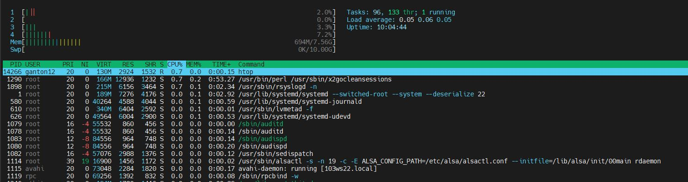</p>
</figure>


## ps

ps command is used to list the currently running processes and their PIDs along with some other information depending on the switches passed to the command. It reads the process information from the virtual files in /proc file-system. /proc contains virtual files of all running processes. The output of the command is similar to that of top with some small differences.

<figure>
  <p align="center">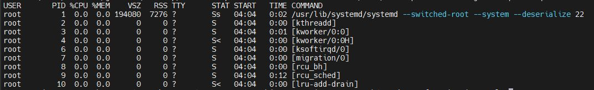</p>
</figure>

### ps output

* USER = user owning the process
* PID = process ID of the process
* %CPU = It is the CPU time used divided by the time the process has been running.
* %MEM = ratio of the process’s resident set size to the physical memory on the machine
* VSZ = virtual memory usage of entire process (in KiB)
* RSS = resident set size, the non-swapped physical memory that a task has used (in KiB)
* TTY = controlling tty (terminal)
* STAT = multi-character process state
* START = starting time or date of the process
* TIME = cumulative CPU time
* COMMAND = command with all its arguments

### Useful commands switches

* ps: shows process of current shell
* ps -A: 
  ps -e: View all running processes
* ps -x: View all processes owned by you
* ps -aux: print all the running process in system regardless from where they have been executed.

## mpstat

Tool used mainly to monitor CPU utilization. The most common use case for mpstat is the following:

```
mpstat -P ALL [# reports] [interval]
```
The -P option indicates the processor number for which statistics are to be reported. In this case (ALL) statistics will be reported for all cores. -P could also take keyword ON which reports statistics for all online cores. The reports parameter indicates the number of reports to be generated by this command and the interval indicates the delay between consecutive reports. For example `mpstat -P ALL 2 1` will generate 2 reports with 1 second delay between them.

<figure>
  <p align="center">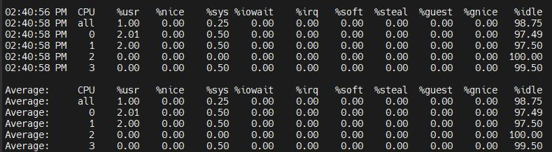</p>
</figure>

### mpstat Output

* %usr: Show the percentage of CPU utilization that occurred while executing at the user level (application).

* %nice: Show the percentage of CPU utilization that occurred while executing at the user level with nice priority.

* %sys: Show the percentage of CPU utilization that occurred while executing at the system level (kernel). Note that this does not include time spent servicing hardware and software interrupts.

* %iowait: Show the percentage of time that the CPU or CPUs were idle during which the system had an outstanding disk I/O request.

* %irq: Show the percentage of time spent by the CPU or CPUs to service hardware interrupts.

* %soft: Show the percentage of time spent by the CPU or CPUs to service software interrupts.

* %steal: Show the percentage of time spent in involuntary wait by the virtual CPU or CPUs while the hypervisor was servicing another virtual processor.

* %guest: Show the percentage of time spent by the CPU or CPUs to run a virtual processor.

* %idle: Show the percentage of time that the CPU or CPUs were idle and the system did not have an outstanding disk I/O request.


## free

free is a command used to check the memory statistics(RAM) of your system. free -g prints the memory statistics in gigabytes.

<figure>
  <p align="center">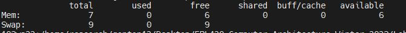</p>
</figure>

* Total: This is the total amount of physical RAM on your system.

* Used: This shows the amount of memory that has been used up or the amount of RAM that is currently being utilized by running programs and processes.

* Free: This is the amount of physical memory that is not currently being used by any running processes and is ready to be allocated to new processes.

* Shared: This displays the total amount of memory used by the temporary tmpfs file system. Tmpfs is a file system that stores files in the computer's main memory (RAM) making it faster to access compared to traditional storage methods like a hard drive.

* Buff/cache: This is the memory that the kernel (operating system) uses to store recently used data so that it can be accessed quickly. It is used to speed up the performance of the computer by reducing the amount of time it takes to access data from the hard drive. Think of it like a temporary storage area where the computer stores data that it might need soon, so that it doesn't have to search for it again later.

* Available: This shows an estimated value of how many memory resources are still open for use. This value can fluctuate as processes start and stop and memory is freed up and allocated. So, while it may not actively be used by a process at the moment, it is still available to be allocated to a process if needed.

## Time
The time command is used to determine how long a given command takes to run.

<figure>
  <p align="center">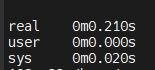</p>
</figure>

* real or total or elapsed (wall clock time) is the time from start to finish of the call. It is the time from the moment you hit the Enter key until the moment the command is completed.
* user - amount of CPU time spent in user mode.
* system or sys - amount of CPU time spent in kernel mode.


## Gnuplot
Sometimes it is really nice to just take a quick look at some data. However, when working on remote computers, it is a bit of a burden to move data files to a local computer to create a plot in something like R. One solution is to use gnuplot and make a quick plot that is rendered in the terminal.

On Debian based distributions, you can install gnuplot using apt:
```
sudo apt update
sudo apt -y install gnuplot
```

Here is a very simplified gnuplot code we can use to plot the latency output of lab1:

set terminal dumb size 120, 30; set autoscale; plot '-' using 1:2 with points notitle
Let's break this down:

`set terminal dumb size 120, 30:` gnuplot has 'terminals', which is essentially the output format for the plot. Here we are using dumb which renders the plot in ASCII characters in the terminal. You can also specify size parameters for the plot, in this case we're using size 120, 30 to make it a bit larger than default (you can play around with this).

`set autoscale:` This just makes it so that the axes are automatically scaled, which is normally desireable.

`plot '-' using 1:2 with points notitle:` Performs the plotting magic. The '-' is the file from which to take the data and plot, which is being read in from STDIN ('-'), but you could specify a file name instead. Next, using 1:2 tells gnuplot to use columns 1 and 2 from the data file for plotting (x = 1, y = 2). Change accordingly to plot any column combination you desire. Finally, with points notitle just makes the plot a point plot with no title.
This should allow for many basic plots (but note the lack of axis labels!). This plotting script is called as follows:
```
gnuplot -p -e "set terminal dumb size 120, 30; set autoscale; plot '-' using 1:2 with points notitle"
```
This basically feeds the script from above into the gnuplot command-line call. The -p flag just allows the plot to persist beyond the command call (otherwise it disappears) and -e tells gnuplot to expect the following script, which is surrounded by quotes.

Try to plot the average latency output from lab1 using the command above. You can find the average latency data under the data directory of this lab. 

<figure>
  <p align="center">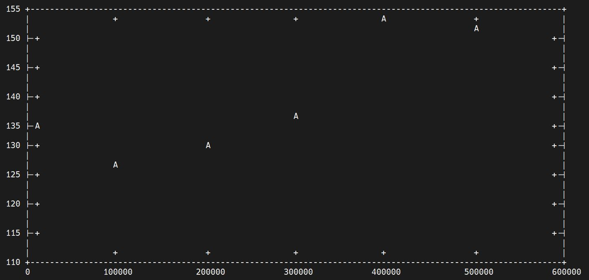</p>
  <figcaption><p align="center">Figure. Example Gnuplot Output.</p></figcaption>
</figure>

In case we want to graph multiple collumns on the same graph we can use the following:
```
gnuplot -p -e "set terminal dumb size 120, 30; set autoscale; plot './average_latency.txt' using 1:2 with points notitle, './average_latency.txt' using 1:3 with points notitle"
```

## Objdump

Objdump is a tool that displays information from object files. We are only going to use it to dissasemble binaries.

```
objdump -d 
```

<figure>
  <p align="center">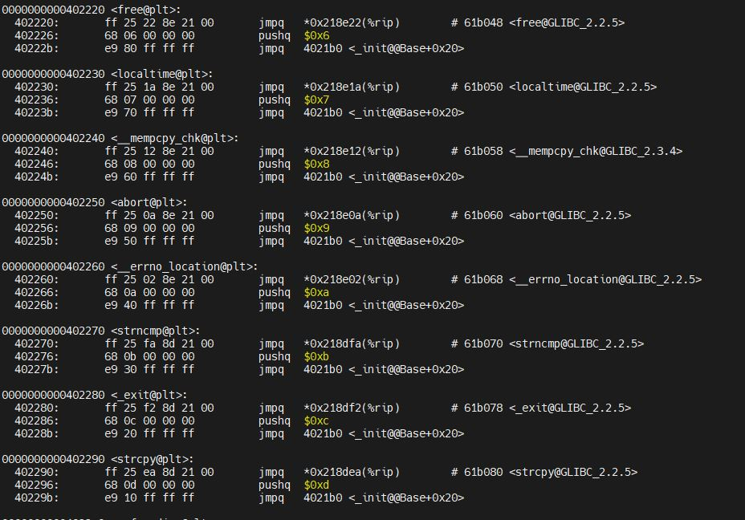</p>
</figure>

It shows the address of each instruction, the entire instruction encoded in hexadecimal and the dissasembled version of each instruction. Additionally it shows the functions under which each instruction executes. The option -d only dissasembles the sections of the object file that contain instructions.

## Correlation Analysis

Correlation analysis is a statistical method used to evaluate the strength of relationship between different quantitative variables. 
* High correlation (close to 1 or -1) means that two or more variables have a strong relationship with each other.
* Weak correlation (close to zero) means that the variables are hardly related.

### R language

Three different correlation analysis: pearson,kendall, spearman
    cor(x, y, method = c("pearson", "kendall", "spearman"))

Example of performance correlation:
```
setwd('C:\\Users\\georg\\Desktop’) //set working directory
rawdata <- read.csv('.\\fotocorellation.out', header = TRUE) //read data from file in csv format with header
str(rawdata) // show content of structure rawdata
head(rawdata,6) //show 6 top lines of the structure
M <-cor(rawdata)  // perform correlation analysis default pearson
library(ggplot2)  // load necessary libraries
library(ggcorrplot)
ggcorrplot(M, method = "square", type = "low" , lab = TRUE) // create the graph  
** finaldata <- rawdata[c(2,3)] //to select specific columns use this **
```

### Excel

* Select Data -> Data Analysis 
* From the Analysis Tools select Correlation

<figure>
  <p align="center">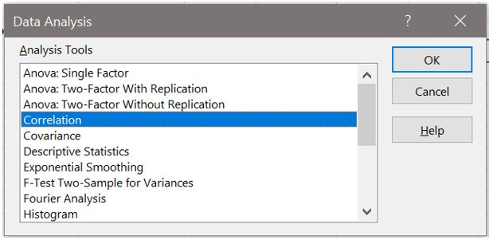</p>
</figure>

* For Input Range select: The data you want to use for the correlation analysis
* For Output Range Select: The space where you want the output to be presented 
`Make sure to select Labels in first row, if your data have labels`

<figure>
  <p align="center">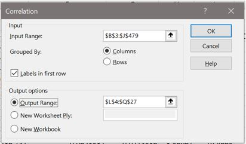</p>
</figure>

Output: 

<figure>
  <p align="center">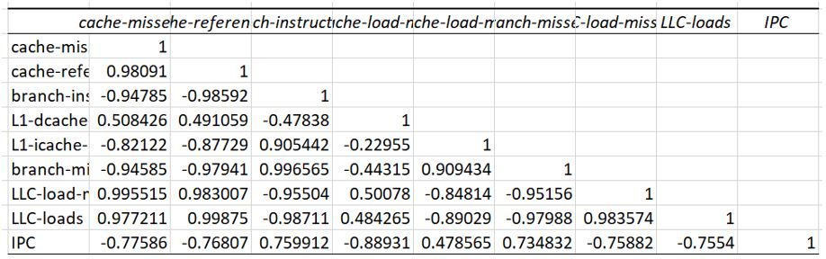</p>
</figure>

`Excel- Load Data Analysis toolkit`

* File -> More -> Options -> Ad ins
* From Manage Select -> Excel Ad ins
* Select the Analysis ToolPak -> Ok

<figure>
  <p align="center">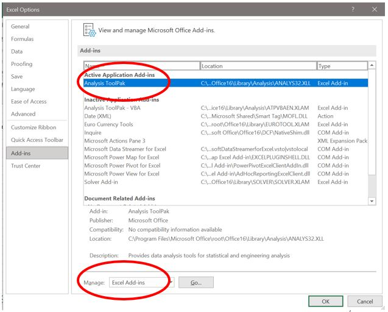</p>
</figure>


### Python

```
import pandas as pd
import matplotlib.pyplot as plt
perf_counters = "./gcccorellation.out"
perf_counters_frame = pd.read_csv(perf_counters)
fig, ax = plt.subplots(figsize=(8,8))
results = perf_counters_frame.corr(method='pearson')
im = ax.imshow(results, interpolation='nearest')
fig.colorbar(im, orientation='vertical', fraction = 0.05)
ax.set_xticks(range(len(perf_counters_frame.columns)))
ax.set_xticklabels(perf_counters_frame.head(), rotation = 90)
ax.set_yticks(range(len(perf_counters_frame.columns)))
ax.set_yticklabels(perf_counters_frame.head())
for i in range(len(perf_counters_frame.columns)):
for j in range(len(perf_counters_frame.columns)):
text = ax.text(j, i, round(results.to_numpy()[i, j], 2), ha="center", va="center", color="black")
plt.show()
```

<figure>
  <p align="center">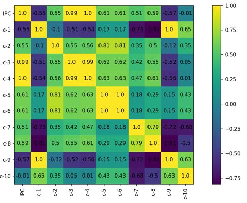</p>
</figure>


### Exercise Correlation Analysis

Για το benchmark σας από την εργασία 1 να παράγετε τα ακόλουθα στατιστικά ανά 1 second:
1.	cache-misses
2.	cache-references
3.	branch-instructions
4.	Instructions
5.	Cycles
6.	L1-dcache-load-misses
7.	L1-icache-load-misses
8.	branch-misses
9.	LLC-load-misses
10.	LLC-loads

```
perf stat -e cache-misses,cache-references,branch-instructions,instructions,cycles,L1-dcache-load-misses,L1-icache-load-misses,branch-misses,LLC-load-misses,LLC-loads ./application
```
Ακολούθως να δείξετε το συσχετισμό που έχει το κάθε στατιστικό με το IPC χρησιμοποιώντας το Correlation Analysis. Σχολιάστε τα αποτελέσματα και τις παρατηρήσεις.  

