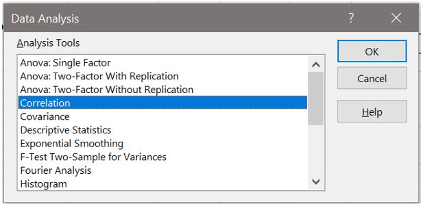
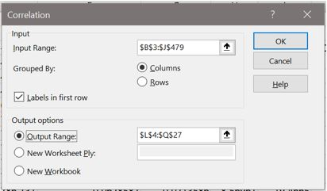
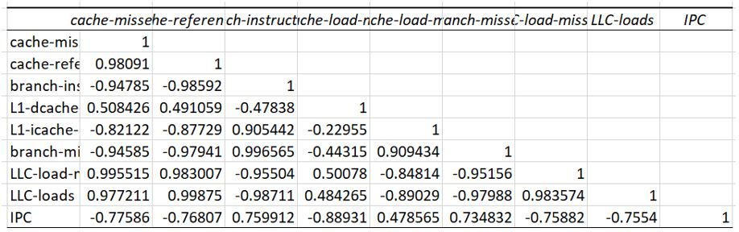
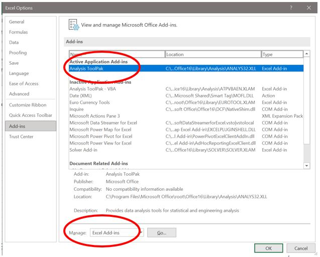
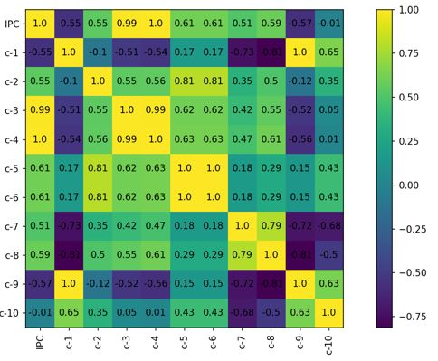

# Lab 4: Performance Counters
The goal of this lab tutorial is to familiarize with linux Perf tool which is a subsystem that provides the necessary "tools" to collect and analyze performance data from performance counters. Performance counters are hardware registers that count hardware events such as number of instructions or cycles etc. Additionally we are going to see how we can use correlation analysis on data gathered from performance counters to reveal different characteristics of our program. 

## Perf
The Linux perf command provides support for sampling applications and reading performance counters. perf consists of two parts: the kernel space implementation and the userland tools.

On Debian based distributions, you can install the perf userland tools using apt:

```
sudo apt update
sudo apt -y install linux-tools-common linux-tools-generic linux-tools-`uname -r`
```

perf stat provides a general performance statistic for a program. You can attach to a running (own) process, monitor a new process or monitor the whole system. The latter is only available for root user, as the performance data can provide hints on the internals of the application.

We can use the following one-liner to find the ID of the process with the highest CPU utilization.

```
ps -eo pid --sort=-%cpu | awk 'NR==2{print $1}'
```
which we can then use to attach perf to the running process:

```
sudo perf stat --pid=`ps -eo pid --sort=-%cpu | awk 'NR==2{print $1}'` sleep 5
```

```
Performance counter stats for process id '6789':

       4422.324322      task-clock (msec)         #    0.884 CPUs utilized          
              9136      context-switches          #    0.002 M/sec                  
              3553      cpu-migrations            #    0.803 K/sec                  
                56      page-faults               #    0.013 K/sec                  
        3536087548      cycles                    #    0.800 GHz                    
        2498325845      instructions              #    0.71  insn per cycle         
         488483203      branches                  #  110.458 M/sec                  
          10398953      branch-misses             #    2.13% of all branches        

       5.002104997 seconds time elapsed

```

### Useful Commands

List of supported events:
```
perf list # or visit https://perfmon-events.intel.com/
```
To measure an event:
```
perf stat -e instructions ./executable
```
To measure multiple events:
```
perf stat -e instructions,cycles ./executable
```
Attach to running process:
```
perf stat -e instructions,cycles -p $! & ##$! Is the Pid of last launced process
perf stat -e instructions,cycles –p `pgrep matrix_serial` &
perf stat -e instructions,cycles -p pid &
```
To print statistics:
```
pkill -SIGINT perf
```
To run only for 1 second:
```
perf stat -e instructions,cycles -p pid sleep 1
```
To take global statistics per core:
```
perf stat -e instructions,cycles -A -C 0-3 sleep 1 # -A Disables statistics aggregation and -C defines which core statistics to print
```

### Exercise Perf Linux

Compile the following files from ./lab04-perf/src directory: matrix_serial_ver1.c, matrix_serial_ver2.c, matrix_serial_ver3.c, matrix_serial_ver4.c using the following commands:

```
gcc -Werror -Wall ./matrix_serial_ver1.c -o matrix_serial_ver1.out
gcc -Werror -Wall ./matrix_serial_ver2.c -o matrix_serial_ver2.out
gcc -Werror -Wall ./matrix_serial_ver3.c -o matrix_serial_ver3.out
gcc -Werror -Wall ./matrix_serial_ver4.c -o matrix_serial_ver4.out
```

Measure the execution time of each version:
```
time ./matrix_serial_ver1.out 
time ./matrix_serial_ver2.out
time ./matrix_serial_ver3.out
time ./matrix_serial_ver4.out
```

For each version measure instructions, cycles, cache-references and cache-misses using perf stat:

```
perf stat -e instructions,cycles,cache-references,cache-misses ./matrix_serial_ver1.out
perf stat -e instructions,cycles,cache-references,cache-misses ./matrix_serial_ver2.out
perf stat -e instructions,cycles,cache-references,cache-misses ./matrix_serial_ver3.out
perf stat -e instructions,cycles,cache-references,cache-misses ./matrix_serial_ver4.out
```

Compare ver1 with ver2 and ver3 with ver4. Why ver2 is faster than ver1 even though the number of instructions is the same?  Why ver4 is faster than ver3 even though ver4 executes more instructions.


Compile the file main.out from ./lab04-perf/src directory using the following commands:

```
gcc main.c –O0 –o mainO0.out
gcc main.c –O1 –o mainO1.out
gcc main.c –O2 –o mainO2.out
gcc main.c –O3 –o mainO3.out
```

For each version measure instructions, cycles, branches and branch-misses using perf stat:

```
perf stat -e instructions,cycles,branches,branch-misses ./mainO0.out
perf stat -e instructions,cycles,branches,branch-misses ./mainO1.out
perf stat -e instructions,cycles,branches,branch-misses ./mainO2.out
perf stat -e instructions,cycles,branches,branch-misses ./mainO3.out
```
What is the impact of each optimization flag on the performance of main.out. What are the optimizations performed? 

## Correlation Analysis

Correlation analysis is a statistical method used to evaluate the strength of relationship between different quantitative variables. 
* High correlation (close to 1 or -1) means that two or more variables have a strong relationship with each other.
* Weak correlation (close to zero) means that the variables are hardly related.

### R language

Three different correlation analysis: pearson,kendall, spearman
    cor(x, y, method = c("pearson", "kendall", "spearman"))

Example of performance correlation:
```
setwd('C:\\Users\\georg\\Desktop’) //set working directory
rawdata <- read.csv('.\\fotocorellation.out', header = TRUE) //read data from file in csv format with header
str(rawdata) // show content of structure rawdata
head(rawdata,6) //show 6 top lines of the structure
M <-cor(rawdata)  // perform correlation analysis default pearson
library(ggplot2)  // load necessary libraries
library(ggcorrplot)
ggcorrplot(M, method = "square", type = "low" , lab = TRUE) // create the graph  
** finaldata <- rawdata[c(2,3)] //to select specific columns use this **
```

### Excel

* Select Data -> Data Analysis 
* From the Analysis Tools select Correlation

<figure>
  <p align="center"></p>
</figure>

* For Input Range select: The data you want to use for the correlation analysis
* For Output Range Select: The space where you want the output to be presented 
`Make sure to select Labels in first row, if your data have labels`

<figure>
  <p align="center"></p>
</figure>

Output: 

<figure>
  <p align="center"></p>
</figure>

`Excel- Load Data Analysis toolkit`

* File -> More -> Options -> Ad ins
* From Manage Select -> Excel Ad ins
* Select the Analysis ToolPak -> Ok

<figure>
  <p align="center"></p>
</figure>


### Python

```
import pandas as pd
import matplotlib.pyplot as plt
perf_counters = "./gcccorellation.out"
perf_counters_frame = pd.read_csv(perf_counters)
fig, ax = plt.subplots(figsize=(8,8))
results = perf_counters_frame.corr(method='pearson')
im = ax.imshow(results, interpolation='nearest')
fig.colorbar(im, orientation='vertical', fraction = 0.05)
ax.set_xticks(range(len(perf_counters_frame.columns)))
ax.set_xticklabels(perf_counters_frame.head(), rotation = 90)
ax.set_yticks(range(len(perf_counters_frame.columns)))
ax.set_yticklabels(perf_counters_frame.head())
for i in range(len(perf_counters_frame.columns)):
for j in range(len(perf_counters_frame.columns)):
text = ax.text(j, i, round(results.to_numpy()[i, j], 2), ha="center", va="center", color="black")
plt.show()
```

<figure>
  <p align="center"></p>
</figure>


### Exercise Correlation Analysis

Για το benchmark σας από την εργασία 1 να παράγετε τα ακόλουθα στατιστικά ανά 1 second:
1.	cache-misses
2.	cache-references
3.	branch-instructions
4.	Instructions
5.	Cycles
6.	L1-dcache-load-misses
7.	L1-icache-load-misses
8.	branch-misses
9.	LLC-load-misses
10.	LLC-loads

```
perf stat -e cache-misses,cache-references,branch-instructions,instructions,cycles,L1-dcache-load-misses,L1-icache-load-misses,branch-misses,LLC-load-misses,LLC-loads ./application
```
Ακολούθως να δείξετε το συσχετισμό που έχει το κάθε στατιστικό με το IPC χρησιμοποιώντας το Correlation Analysis. Σχολιάστε τα αποτελέσματα και τις παρατηρήσεις.  

