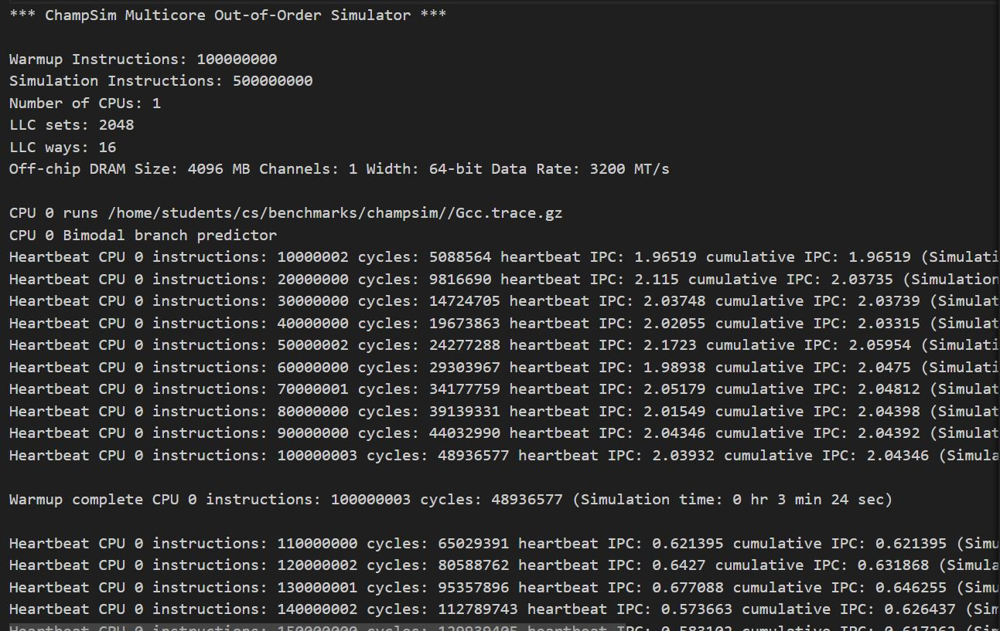

# Lab 4: ChampSim
The goal of this lab tutorial is to familiarize with the ChampSim simulator (https://github.com/ChampSim/ChampSim.git).

## ChampSim

ChampSim is a trace-based simulator for a microarchitecture study. It simulates a high performance OoO core and it is used to examine ideas mainly related with data prefetching, branch prediction and cache replacement policies. It is written in C++, it is easily extensible and it's the simulator used for the Data Prefetching Champioship and Cache Replacement Championship. For the purposes of the lab we use an older version of the simulator that prints additional branch statistics. 

### Clone ChampSim repository
```
git clone https://github.com/ucy-xilab/cs605-fa23.git
cd ./cs605-fa23/labs/lab05-ChampSim/ChampSim
```

### Compile

ChampSim takes six parameters: Branch predictor, L1D prefetcher, L2C prefetcher, LLC prefetcher, LLC replacement policy, and the number of cores. 
For example, `./build_champsim.sh bimodal no no no lru 1` builds a single-core processor with bimodal branch predictor, no L1/L2/LLC data prefetchers, and the baseline LRU replacement policy for the LLC.
```
$ ./build_champsim.sh bimodal no no no no lru 1

$ ./build_champsim.sh ${BRANCH} ${L1I_PREFETCHER} ${L1D_PREFETCHER} ${L2C_PREFETCHER} ${LLC_PREFETCHER} ${LLC_REPLACEMENT} ${NUM_CORE}
```

### Download DPC-3 trace

Professor Daniel Jimenez at Texas A&M University kindly provided traces for DPC-3. Use the following script to download these traces (~20GB size and max simpoint only).
```
$ cd scripts

$ ./download_dpc3_traces.sh
```

### UCY Traces for SPEC2017

SPEC2017 traces already exist under the directory `/home/students/cs/benchmarks/champsim/`. All students with cs account should be able to access them. 

### Run simulation

Execute `run_champsim.sh` with proper input arguments. The default `TRACE_DIR` in `run_champsim.sh` is set to `/home/students/cs/benchmarks/champsim/`.

* Single-core simulation: Run simulation with `run_champsim.sh` script.

```
Usage: ./run_champsim.sh [BINARY] [N_WARM] [N_SIM] [TRACE] [OPTION]
$ ./run_champsim.sh bimodal-no-no-no-lru-1core 1 10 400.perlbench-41B.champsimtrace.xz

${BINARY}: ChampSim binary compiled by "build_champsim.sh" (bimodal-no-no-lru-1core)
${N_WARM}: number of instructions for warmup (1 million)
${N_SIM}:  number of instructinos for detailed simulation (10 million)
${TRACE}: trace name (400.perlbench-41B.champsimtrace.xz)
${OPTION}: extra option for "-low_bandwidth" (src/main.cc)
```
Simulation results will be stored under "results_${N_SIM}M" as a form of "${TRACE}-${BINARY}-${OPTION}.txt". 

* Multi-core simulation: Run simulation with `run_4core.sh` script.
```
Usage: ./run_4core.sh [BINARY] [N_WARM] [N_SIM] [N_MIX] [TRACE0] [TRACE1] [TRACE2] [TRACE3] [OPTION]
$ ./run_4core.sh bimodal-no-no-no-lru-4core 1 10 0 400.perlbench-41B.champsimtrace.xz \\
  401.bzip2-38B.champsimtrace.xz 403.gcc-17B.champsimtrace.xz 410.bwaves-945B.champsimtrace.xz
```
Note that we need to specify multiple trace files for `run_4core.sh`. `N_MIX` is used to represent a unique ID for mixed multi-programmed workloads. 


### Add your own branch predictor, data prefetchers, and replacement policy
**Copy an empty template**
```
$ cp branch/branch_predictor.cc prefetcher/mybranch.bpred
$ cp prefetcher/l1d_prefetcher.cc prefetcher/mypref.l1d_pref
$ cp prefetcher/l2c_prefetcher.cc prefetcher/mypref.l2c_pref
$ cp prefetcher/llc_prefetcher.cc prefetcher/mypref.llc_pref
$ cp replacement/llc_replacement.cc replacement/myrepl.llc_repl
```

**Work on your algorithms with your favorite text editor**
```
$ vim branch/mybranch.bpred
$ vim prefetcher/mypref.l1d_pref
$ vim prefetcher/mypref.l2c_pref
$ vim prefetcher/mypref.llc_pref
$ vim replacement/myrepl.llc_repl
```

**Compile and test**
```
$ ./build_champsim.sh mybranch mypref mypref mypref myrepl 1
$ ./run_champsim.sh mybranch-mypref-mypref-mypref-myrepl-1core 1 10 bzip2_183B
```

### Evaluate Simulation

ChampSim measures the IPC (Instruction Per Cycle) value as a performance metric. 
There are some other useful metrics printed out at the end of simulation.

<figure>
  <p align="center"></p>
  <figcaption><p align="center">Figure. Example Output of ChampSim.</p></figcaption>
</figure>


### Exercise: Find the most predicted branch of GCC
Build a single core simulator with bimodal predictor, no prefetching and lru replacement policy. Run the simulator with the gcc trace for 100 Million warmup instructions and 500 Million instructions for detailed simulation. Find the branch address that executes the most and has the least mispredictions. Then find the instruction that maps to that adress using objdump (use static compiled binaries). Finally, find the same instruction but in the source code of the benchmark.   
