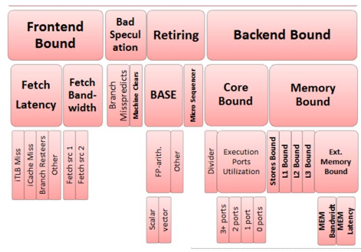
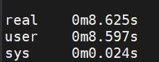
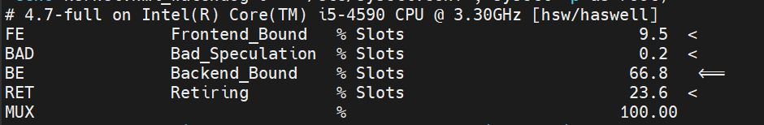
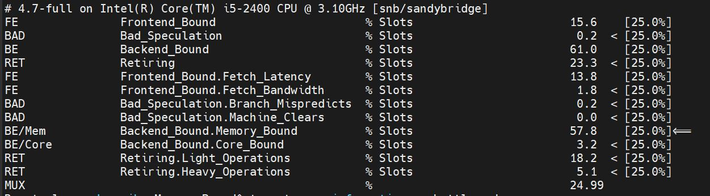
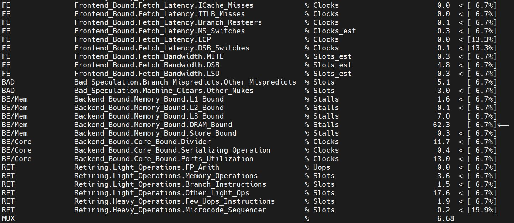
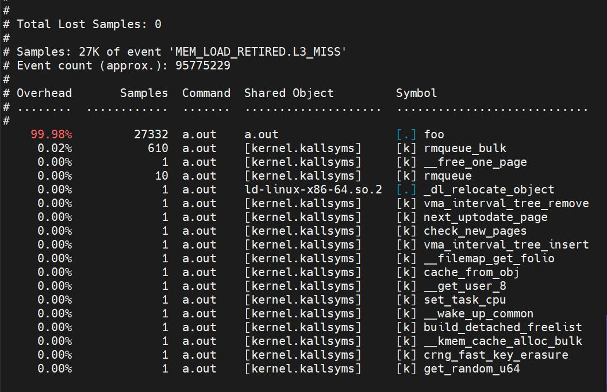
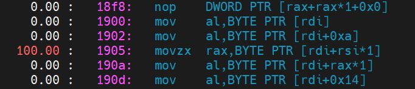
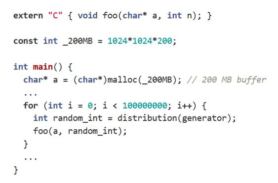
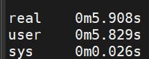

# Lab 9: Top-Down Analysis
The goal of this lab tutorial is to familiarize with Top-Down analysis. Top-Down analysis is a method used to identify bottlenecks in an out-of-order CPU.   


## Top-Down Analysis
* A feasible, fast method that identifies critical bottlenecks in Out of Order CPUs.

* Hierarchical organization of event-based metrics that identifies the dominant performance bottleneck in an application.

* Aim to show on average how well the CPU pipeline is being utilized while running an application.

## Top-Down Analysis Hierarchy

The analysis categorizes each pipeline slot into the following categories:
* Frontend Bound: Slots lost due to the frontend not delivering instructions to the backend
* Bad Speculation: Slots lost while executing in the wrong path
* Backend Bound: Slots lost due to the backend not being able to serve any instructions
* Retiring: Useful Slots

The categories above are the first level analysis. Top-Down support multi-level analysis. The deeper the analysis the more specific the results about the bottleneck. Eaxh level of the analysis uses different models that are independent from the previous level. The models are publicly available from the open source org of Intel(https://download.01.org/perfmon/TMA_Metrics.xlsx ). 

<figure>
  <p align="center"></p>
  <figcaption><p align="center">Figure. Top-Down Analysis Hierarchy.</p></figcaption>
</figure>


## Tools that support Top-Down Analysis

* Toplev Tool, part of pmu-tools written by Andi Kleen  (public available)
    https://github.com/andikleen/pmu-tools

* Intel Vtune Profiler, build -  in support for TMAM:
    https://www.intel.com/content/www/us/en/developer/tools/oneapi/vtune-profiler-download.html?wapkw=intel%20vtune%20

* Perf Linux : --topdown option, measures only topdown level 1 statistics
    https://man7.org/linux/man-pages/man1/perf-stat.1.html


## Bibliography

* A. Yasin, "A Top-Down method for performance analysis and counters architecture," 2014 IEEE International Symposium on Performance Analysis of Systems and Software (ISPASS), Monterey, CA, USA, 2014, pp. 35-44, doi: 10.1109/ISPASS.2014.6844459. https://ieeexplore.ieee.org/document/6844459
* https://www.intel.com/content/www/us/en/develop/documentation/vtune-cookbook/top/methodologies/top-down-microarchitecture-analysis-method.html
* https://www.intel.com/content/www/us/en/develop/documentation/vtune-help/top/reference/cpu-metrics-reference.html
* https://www.intel.com/content/www/us/en/develop/documentation/vtune-cookbook/top/tuning-recipes/frequent-dram-accesses.html
* https://easyperf.net/blog/2019/02/09/Top-Down-performance-analysis-methodology


## Exercise

In this exercise we will try to use Top-Down analysis in a real word scenario, where we try to identify the bottlenecks of a program . For the purposes of the exercise you will need the following files-tools:
* Program: located under the src directory of lab09
* Tool to perform Top-Down analysis: pmu-tools

### Install pmu-tools
The pmu-tools is a set of tools and libraries for profile collection and performance analysis on Intel CPUS on top of Linux perf. Pmu-tools does not require any compilation as it is written in python. It uses performance counters to perform the Top-Down Analysis. As we do not have root permissions (lab 103) some steps of the analysis will not execute. In these cases the instructor will perform the steps.

Download tools using the following command:
```
git clone https://github.com/andikleen/pmu-tools.git

```

### Compile Program

The src directory contains the following files:
* a.cpp: Creates and initializes an array
* foo.asm: Function used to initialize specific cells of the array
* foo.o: Object file of foo function

To compile the program use the following commands:

```
g++ a.cpp -O2 -c -std=c++11
g++ a.o foo.o
```
The executable is created with the name `a.out`.

### Performance Analysis

Use the following steps to identify the bottlenecks of the program:
1) Measure the execution time of the program 
    ```
    time ./a.out
    ```
<figure>
  <p align="center"></p>
  <figcaption><p align="center">Figure. Execution time of program.</p></figcaption>
</figure>


2) Perform level 1 Top-Down analysis on the executable using toplev of pmu-tools.
    ```
    ./toplev.py --core S0-C0 -l1 -v --no-desc taskset -c 0 ./a.out
    ```
    * toplev: tools of pmu-tools that perform Top-Down analysis
    * --core: measure program running on core 0 socket 0
    * -lx: level of the analysis
    * -v: shows all categories (not just the one with the highest overhead)
    * --no-desc: hides the description of each category
    * taskset -c 0 ./a.out: executable mapped to core 0

    Which category has the highest percentage?

<figure>
  <p align="center"></p>
  <figcaption><p align="center">Figure. Top-Down Analysis Level 1.</p></figcaption>
</figure>

3)  Perform level 2 Top-Down analysis on the executable using toplev of pmu-tools. (instructor)
    ```
    ./toplev.py --core S0-C0 -l2 -v --no-desc taskset -c 0 ./a.out
    ```
    Which category has the highest percentage?

<figure>
  <p align="center"></p>
  <figcaption><p align="center">Figure. Top-Down Analysis Level 2.</p></figcaption>
</figure>


4)  Perform level 3 Top-Down analysis on the executable using toplev of pmu-tools. (instructor)
    ```
    ./toplev.py --core S0-C0 -l3 -v --no-desc taskset -c 0 ./a.out
    ```

    Which category has the highest percentage?

<figure>
  <p align="center"></p>
  <figcaption><p align="center">Figure. Top-Down Analysis Level 3.</p></figcaption>
</figure>

5)  In the file that contains the model of each category (https://download.01.org/perfmon/TMA_Metrics.xlsx) there is a column called Locate-with. This collumn provides the performance counter event that we can use to locate the exact place in the code where the issue occurs. For DRAM-Bound Category we use MEM_LOAD_RETIRED.L3_MISS_PS. We use perf record to collect samples for the event MEM_LOAD_RETIRED.L3_MISS_PS while we run our program. The samples are saved into the perf.data file. 

```
sudo perf record -e cpu/event=0xd1,umask=0x20,name=MEM_LOAD_RETIRED.L3_MISS/ppp ./a.out
```


6) To analyze the data we use perf report. The perf report command reads the file perf.data and generates a concise execution profile. By default, samples are sorted by functions with the most samples first. It is possible to customize the sorting order and therefore to view the data differently. The column 'Overhead' indicates the percentage of the overall samples collected in the corresponding function. The second column reports the process from which the samples were collected. The third column shows the name of the ELF image where the samples came from. If a program is dynamically linked, then this may show the name of a shared library. When the samples come from the kernel, then the pseudo ELF image name [kernel.kallsyms] is used.

```
sudo perf report -n --stdio
```

<figure>
  <p align="center"></p>
  <figcaption><p align="center">Figure. Locate function/process responsible for slow-down.</p></figcaption>
</figure>


7) Perf annotate helps us to drill down to the instruction level. Specifically it allows as to see the instructions responsible for a specific event.

```
sudo perf annotate --stdio -M intel foo
```

<figure>
  <p align="center"></p>
  <figcaption><p align="center">Figure. Locate Instructions responsible for slow-down.</p></figcaption>
</figure>

6) Fix bottleneck: Why we have high LLC misses? How we can fix this?

<figure>
  <p align="center"></p>
  <figcaption><p align="center">Figure. Program Content.</p></figcaption>
</figure>

    ```
    __builtin_prefetch ( a + random_int, 0, 1);
    ```

7) Measure execution time of program. 
    
<figure>
  <p align="center"></p>
  <figcaption><p align="center">Figure. Execution time of program.</p></figcaption>
</figure>
